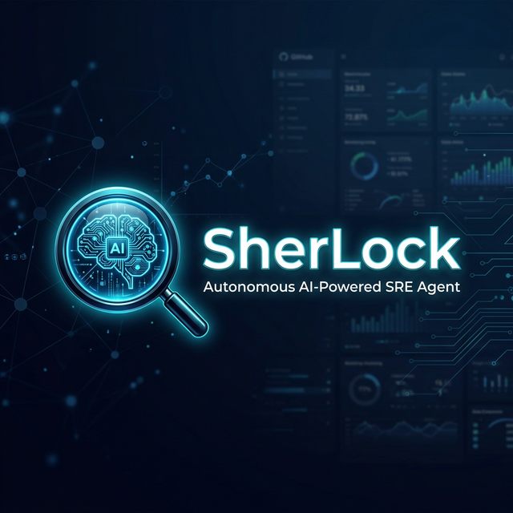
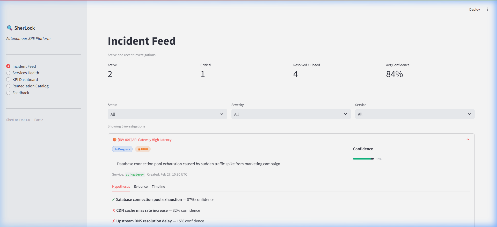

<p align="center">
  
</p>

<p align="center">
  <strong>An autonomous AI-powered Site Reliability Engineering agent that investigates production incidents, identifies root causes, and orchestrates remediation — in minutes, not hours.</strong>
</p>

<p align="center">
  <a href="https://jay-1806-sherlock-autonomous-ai-sre-ag-streamlit-app-1dkptw.streamlit.app"></a>
  
  
  
  
  
  
</p>

---

## 🎯 Problem Statement

Modern production environments generate thousands of alerts daily. SRE teams are overwhelmed with manual triage, investigation, and remediation — leading to extended MTTR, on-call burnout, and missed root causes.

**SherLock** solves this by acting as an autonomous SRE agent that:
- 🔍 **Investigates** incidents using structured hypothesis-driven reasoning
- 🧠 **Identifies root causes** by correlating metrics, logs, traces, and deployment data
- ⚡ **Orchestrates remediation** through pre-approved auto-healing actions with safety controls
- 📊 **Reports** findings with confidence scores, evidence trails, and actionable recommendations

---

## 🖥️ Live Demo

> **Try it now →** [**SherLock Streamlit Dashboard**](https://jay-1806-sherlock-autonomous-ai-sre-ag-streamlit-app-1dkptw.streamlit.app)

<p align="center">
  
</p>

---

## 🏗️ Architecture

SherLock is built as a **two-part system** designed for production-grade reliability:

```
┌─────────────────────────────────────────────────────────────────────┐
│                        Part 1: Intelligence Backend                 │
│                                                                     │
│  ┌──────────┐    ┌─────────┐    ┌──────────────┐    ┌───────────┐  │
│  │ Ingestion│───▶│  Kafka  │───▶│  Neo4j Graph │◀──▶│ LangGraph │  │
│  │ Airbyte  │    │  Topics │    │  Knowledge   │    │  Agent    │  │
│  │ OTel     │    └─────────┘    │  Base        │    │  GPT-4o   │  │
│  └──────────┘                   └──────────────┘    └─────┬─────┘  │
│                                                           │        │
│                                    InvestigationResult JSON│       │
├───────────────────────────────────────────────────────────┼────────┤
│                        Part 2: API & Dashboard            │        │
│                                                           ▼        │
│  ┌──────────────┐    ┌──────────────┐    ┌──────────────────────┐  │
│  │  FastAPI      │◀──▶│  Webhooks    │    │  Streamlit Dashboard │  │
│  │  REST API     │    │  PagerDuty   │    │  Next.js Dashboard   │  │
│  │  16 Endpoints │    │  CloudWatch  │    │  Incident Feed       │  │
│  │  Prometheus   │    │  OpsGenie    │    │  KPI Metrics         │  │
│  └──────────────┘    └──────────────┘    └──────────────────────┘  │
└─────────────────────────────────────────────────────────────────────┘
```

### Part 1 — Data & Intelligence Backend
| Component | Technology | Purpose |
|-----------|-----------|---------|
| **Ingestion** | Airbyte + OpenTelemetry Collector | Streams metrics, logs, traces into Kafka |
| **Knowledge Graph** | Neo4j Aura | Service topology, incidents, deployments, hosts |
| **Agent** | LangGraph + GPT-4o | Hypothesis-driven investigation with confidence scoring |
| **Evals** | Custom harness | Accuracy, latency, and calibration benchmarks |

### Part 2 — API & Dashboard
| Component | Technology | Purpose |
|-----------|-----------|---------|
| **REST API** | FastAPI | 16 endpoints — investigations, webhooks, remediation, metrics |
| **Dashboard** | Streamlit + Next.js 14 | Real-time incident feed, service health, KPI visualization |
| **Webhooks** | HMAC-SHA256 | PagerDuty, CloudWatch, OpsGenie alert ingestion |
| **Remediation** | Pre-approved catalog | 8 auto-healing actions with MFA, blast-radius, and confidence gates |
| **Infra** | Terraform + K8s + Helm | Production-ready IaC for AWS deployment |

---

## ✨ Key Features

### 🔬 AI-Powered Investigation Engine
- Structured hypothesis generation with confidence scoring
- Multi-source evidence correlation (metrics, logs, traces, deployments)
- Automatic root cause analysis with supporting evidence chains

### 🛡️ Safe Auto-Remediation
- Pre-approved remediation catalog with risk levels (low/medium/high)
- MFA enforcement for medium and high-risk actions
- Blast radius validation (max 3 services)
- Dry-run mode for testing before execution
- Full audit trail with pre/post state capture

### 📊 Comprehensive Observability
- 8 platform KPIs with trend tracking and sparkline visualization
- Prometheus-format `/metrics` endpoint for external scraping
- Service health scoring with dependency mapping
- Real-time incident timeline with event correlation

### 🔔 Multi-Source Alert Ingestion
- Webhook receivers for PagerDuty, CloudWatch, OpsGenie
- HMAC-SHA256 signature verification
- 5-minute deduplication window
- Severity normalization across providers
- Priority-based triage (P1/P2 immediate, P3/P4 queued)

---

## 📂 Project Structure

```
SherLock/
├── agent/                  # LangGraph investigation engine
│   ├── graph/              #   State machine nodes & edges
│   ├── llm/                #   GPT-4o integration
│   ├── prompts/            #   System & investigation prompts
│   ├── tools/              #   Neo4j, Tavily search tools
│   └── confidence/         #   Calibration scoring
├── graph/                  # Neo4j knowledge graph
│   ├── schema/             #   Constraints, indexes
│   ├── fixtures/           #   Seed data
│   ├── writer/             #   Kafka → Neo4j event handlers
│   └── embeddings/         #   Vector search support
├── ingestion/              # Data ingestion pipeline
│   ├── airbyte/            #   Source connectors
│   └── otel/               #   OpenTelemetry Collector config
├── evals/                  # Evaluation harness
│   ├── dataset/            #   Test cases
│   ├── metrics/            #   Accuracy, latency metrics
│   └── runners/            #   CI-integrated runners
├── api/                    # FastAPI REST API
│   └── src/app/
│       ├── routers/        #   8 route modules
│       ├── models/         #   Pydantic schemas
│       └── services/       #   Business logic & data layer
├── dashboard/              # Next.js 14 dashboard
├── infra/                  # Infrastructure as Code
│   ├── terraform/          #   AWS resources
│   ├── k8s/                #   Kubernetes manifests
│   └── helm/               #   Helm charts
├── deploy/                 # Deployment configs
│   ├── docker/             #   Dockerfiles
│   └── render/             #   Render YAML configs
├── streamlit_app.py        # Streamlit dashboard (deployed)
├── requirements.txt        # Streamlit Cloud dependencies
└── requirements-backend.txt # Backend dependencies
```

---

## 🚀 Quick Start

### Prerequisites
- Python 3.11+
- Node.js 20+
- Docker & Docker Compose
- Neo4j Aura instance (or local via Docker)

### 1. Clone & Install

```bash
git clone https://github.com/jay-1806/SherLock_Autonomous-AI-SRE-Agent.git
cd SherLock_Autonomous-AI-SRE-Agent

# Backend dependencies
pip install -r requirements-backend.txt

# Or use make
make install
```

### 2. Configure Environment

```bash
cp .env.example .env
# Edit .env with your API keys:
#   OPENAI_API_KEY, NEO4J_URI, NEO4J_PASSWORD, TAVILY_API_KEY
```

### 3. Start Infrastructure

```bash
docker-compose up -d        # Neo4j + Kafka
python -m graph.schema.apply  # Create graph constraints
python -m graph.fixtures.load # Load seed data
```

### 4. Run the Agent

```bash
# Investigation engine (Part 1)
make agent
# → http://localhost:8001

# REST API (Part 2)
cd api && pip install -e . && uvicorn src.app.main:app --reload --port 8000
# → http://localhost:8000/docs

# Next.js Dashboard
cd dashboard && npm install && npm run dev
# → http://localhost:3000

# Streamlit Dashboard
python -m streamlit run streamlit_app.py
# → http://localhost:8501
```

---

## 🧪 API Endpoints

| Method | Endpoint | Description |
|--------|----------|-------------|
| `GET` | `/health` | Platform health check with subsystem status |
| `GET` | `/investigations` | List investigations (filterable by status, severity, service) |
| `GET` | `/investigations/{id}` | Full investigation with hypotheses, evidence, timeline |
| `GET` | `/investigations/{id}/graph` | Graph topology for visualization |
| `GET` | `/services` | Service health with scores and SLA tiers |
| `GET` | `/services/{name}` | Detailed service info with dependencies |
| `GET` | `/services/{name}/history` | Incident history and RCA trends |
| `POST` | `/webhooks/alert` | Receive alerts from PagerDuty/CloudWatch/OpsGenie |
| `GET` | `/remediation/catalog` | List pre-approved remediation actions |
| `GET` | `/remediation/catalog/{id}` | Single remediation action details |
| `POST` | `/remediation/{id}/execute` | Execute remediation with safety controls |
| `GET` | `/remediation/executions` | Execution audit log |
| `GET` | `/evals/summary` | KPI metrics and eval scores |
| `GET` | `/metrics` | Prometheus-format metrics for scraping |
| `GET` | `/feedback` | List engineer RCA ratings |
| `POST` | `/feedback/{investigation_id}` | Submit accuracy rating for investigation |

> Full interactive docs available at [`/docs`](http://localhost:8000/docs) (Swagger UI) and [`/redoc`](http://localhost:8000/redoc)

---

## 📈 Platform KPIs

| KPI | Current | Target | Status |
|-----|---------|--------|--------|
| Mean Time to Root Cause | 4.2 min | < 5 min | ✅ On Track |
| Investigation Accuracy | 87% | ≥ 85% | ✅ On Track |
| Autonomous Coverage | 83% | ≥ 80% | ✅ On Track |
| Alert-to-Investigation Latency | 2.8 min | < 3 min | ✅ On Track |
| Auto-Remediation Success Rate | 94% | ≥ 90% | ✅ On Track |
| False Positive Escalation Rate | 3.2% | < 5% | ✅ On Track |
| On-Call Toil Reduction | 62% | ≥ 60% | ✅ On Track |
| Engineer NPS | +42 | ≥ +30 | ✅ On Track |

---

## 🛠️ Tech Stack

<table>
<tr>
<td><strong>Category</strong></td>
<td><strong>Technologies</strong></td>
</tr>
<tr>
<td>AI/LLM</td>
<td>LangGraph, LangChain, OpenAI GPT-4o, Tavily Search</td>
</tr>
<tr>
<td>Backend</td>
<td>FastAPI, Pydantic, Uvicorn, Python 3.11+</td>
</tr>
<tr>
<td>Frontend</td>
<td>Next.js 14, React, TypeScript, Streamlit, Plotly</td>
</tr>
<tr>
<td>Database</td>
<td>Neo4j Aura (Knowledge Graph), Vector Search</td>
</tr>
<tr>
<td>Streaming</td>
<td>Apache Kafka (AWS MSK), Airbyte, OpenTelemetry</td>
</tr>
<tr>
<td>Infrastructure</td>
<td>Terraform, Kubernetes, Helm, Docker</td>
</tr>
<tr>
<td>Cloud</td>
<td>AWS (ECS, S3, SQS, Lambda, CloudWatch)</td>
</tr>
<tr>
<td>CI/CD</td>
<td>GitHub Actions, Render, Streamlit Cloud</td>
</tr>
<tr>
<td>Monitoring</td>
<td>Prometheus, Datadog, PagerDuty, OpsGenie</td>
</tr>
</table>

---

## 🧪 Testing

```bash
# Unit tests
pytest tests/unit -v

# Full test suite with coverage
make test

# Eval harness (accuracy)
make eval

# Latency benchmarks
make eval-latency

# Confidence calibration
make eval-calibration
```

---

## 📦 Deployment

### Streamlit Cloud (Dashboard)
The Streamlit dashboard is deployed and accessible at the live demo link above.

### Render (API + Workers)
Deploy configs are in `deploy/render/`:
- `api.render.yaml` — FastAPI service
- `dashboard.render.yaml` — Next.js frontend
- `workers.render.yaml` — Background workers

### Docker
```bash
# API
docker build -f deploy/docker/api.Dockerfile -t sherlock-api .

# Dashboard
docker build -f deploy/docker/dashboard.Dockerfile -t sherlock-dashboard .
```

### Kubernetes
```bash
kubectl apply -f infra/k8s/
# Or with Helm:
helm install sherlock infra/helm/sherlock/
```

---

## 🗺️ Roadmap

- [x] Investigation engine with LangGraph + GPT-4o
- [x] Neo4j knowledge graph with service topology
- [x] FastAPI REST API with 16 endpoints
- [x] Streamlit + Next.js dashboards
- [x] Webhook ingestion (PagerDuty, CloudWatch, OpsGenie)
- [x] Auto-remediation with safety controls
- [x] Eval harness (accuracy, latency, calibration)
- [x] CI/CD pipeline with GitHub Actions
- [x] Infrastructure as Code (Terraform, K8s, Helm)
- [ ] Real-time WebSocket investigation updates
- [ ] Multi-tenant support
- [ ] Runbook automation integration
- [ ] Slack/Teams bot for investigation summaries

---

## 📄 License

This project is licensed under the MIT License.

---

<p align="center">
  <strong>Built with ❤️ for the SRE community</strong><br/>
  <sub>Reducing MTTR from hours to minutes, one investigation at a time.</sub>
</p>
